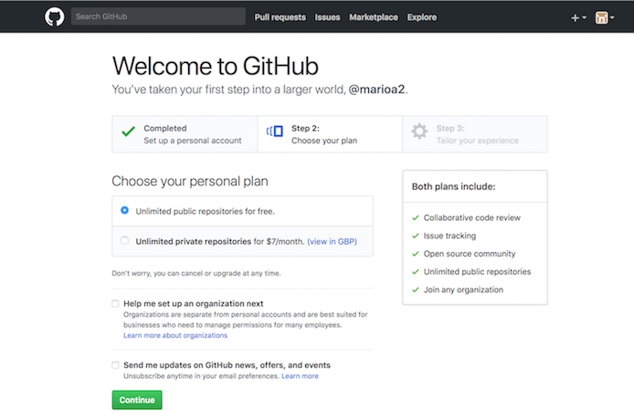

---

theme: sky
revealOptions:
    slideNumber: true

---

# Git

Note: The default keyboard shortcuts are:

* Up, Down, Left, Right: Navigation
* f: Full-screen
* s: Show slide notes
* o: Toggle overview
* . (Period or b: Turn screen black
* Esc: Escape from full-screen, or toggle overview

---

### Scenario

<small>
From: http://www.phdcomics.com/comics/archive.php?comicid=1531
</small>

----

### Other scenarios

* You want to work on files across systems
   * E.g. home PC, your laptop & work PC
   * How do you keep files synchronized?
* Want to know provenance of the code
* Need to check previous code version
* Your laptop is stolen! 
* Your disk fails/accidentally delete files

----

### Answer: version control !

* Also known as  *revision control* or *source control*
  * There are others: SVN, mercurial, ...
* Records &  preserves history of changes to files
* Not just for source code:
  * Configuration files
  * Parameter sets
  * Data files
  * User documentation & manuals
  * Conference/journal papers, book chapters

----

### With version control you can...

* Keep track of changes
   * Lab notebook for code/documents
* Roll back to points in the change history
* Back up history of changes to various locations
* Work on files from multiple locations/systems
* Identify and resolve conflicts
   * Same file is edited by more than one user
* Collaborate on code/documents/other files

---

### We will cover ...

1. Tracking changes with a local repository

2. Working with a remote repository

3. Collaborating with colleagues using a repository

----

### You can get dedicated git GUIs

<small>
SmartGit (free for non-commercial use)
</small>

----

### Or as part of an IDE

<small>
Rstudio
</small>

* But we will use git from the shell

----

### Why use the shell ?

* All IDEs/GUIs will use shell commands
* GUI may not be available remotely
* You can still use a GUI locally
   * Use git on remote machine
* But you have a choice
   * Easier: command line -> GUI

---

###  Initiatialise local repository

1. Tell git who you are:
    * email address 
	* your name
2. You **add** files to repository
3. Files are then in one of the following states:
    * **untracked** - repository does not know them
    * **tracked** - you have *add*ed them
       * **unmodified** - you have not changed tracked file 
       * **modified** - you have changed tracked files
    * **staged** - about to be added to the repository

----

### States

----

## Let's start ...

---

## Setting up remote repositories

----

### Service Providers

* *SOPA Local GitLab* 
* *GitHub* (https://github.com)
* *Bitbucket* (http://bitbucket.org)
* *GitLab* (https://about.gitlab.com)
* *Launchpad* (https://launchpad.net)
* *SourceForge* (http://sourceforge.net)
* ….

For more options see: https://git.wiki.kernel.org/index.php/GitHosting

----

## Create new account on GitHub 1

----

## Create new account on GitHub 2

Verify Your email address

----

## Create a new repository

---

## Create Repository

---

## Recap

What we have learnt:
* Know how to create remote repositories.
* Know how to clone repositories.
* Know how to push content to the repository.
* Know how to fetch and merge or pull content.
* Know how to resolve conflicts.

Next we look at establishing collaborations.

---

### More stuff

Not enough time to cover:

* Forking code
* Branching
* For public repositories, LICENCE your code
   * Permissive: BSD, Apache, ...
   * Viral: GPL, ... 

----

## Hopefully not

<small>
From: http://xkcd.com/1597/
</small>

----

## Further information

* Visual Git Reference - pictorial representations of what Git commands do (http://marklodato.github.io/visual-git-guide/index-en.html).
* Pro Git - the "official" online Git book (http://git-scm.com/book)
* Version control by example - an acclaimed online book on version control by Eric Sink (http://www.ericsink.com/vcbe/)

---

## End

---

## On branching

----

## What is this master thing?

## Why branch?

* At some point you may want to fork your code, say after a release:

----

## Popular model

* A release branch, representing a released version of the code.

* A master branch, representing the most up-to-date stable version of the code.

* Various feature and/or developer-specific branches representing work-in-progress, new features, etc.

----

## Example

* Can have more complex topologies:

----

## What do we now know

* Know how initialise a local repository
* How to add files
* How to commit files
* How to navigate between different versions
* How look at the file log
* How to tag files
* Know what a branch is
